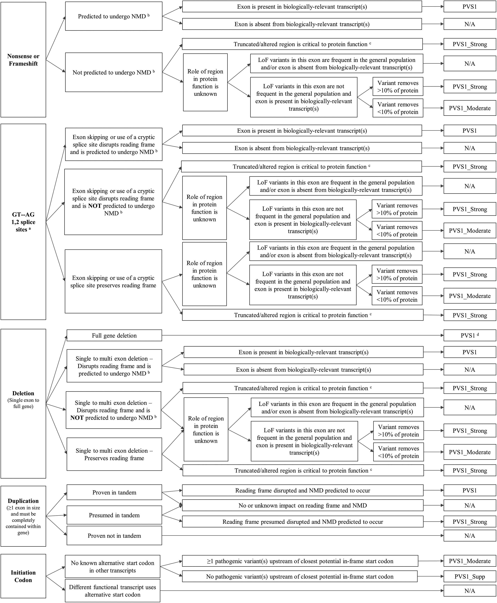

.. _acmg_seqvars:

===============================
Sequence Variant Classification
===============================

This section describes the ACMG classification for sequence variants.

.. _acmg_seqvars-references:

----------
References
----------

It is based on the following publications, also `listed on the ClinGen Website <https://clinicalgenome.org/working-groups/sequence-variant-interpretation/>`__.

- Richards S, Aziz N, Bale S, Bick D, Das S, Gastier-Foster J, Grody WW, Hegde M, Lyon E, Spector E, Voelkerding K, Rehm HL; ACMG Laboratory Quality Assurance Committee.
  *Standards and guidelines for the interpretation of sequence variants: a joint consensus recommendation of the American College of Medical Genetics and Genomics and the Association for Molecular Pathology.*
  Genet Med. 2015 May;17(5):405-24. doi: 10.1038/gim.2015.30. Epub 2015 Mar 5. PMID: 25741868; PMCID: PMC4544753.
- Biesecker LG, Harrison SM; ClinGen Sequence Variant Interpretation Working Group.
  *The ACMG/AMP reputable source criteria for the interpretation of sequence variants.*
  Genet Med. 2018 Dec;20(12):1687-1688. doi: 10.1038/gim.2018.42. PMID: 29543229; PMCID: PMC6709533.
- ClinGen Sequence Variant Interpretation Work Group.
  *Recommendations for ACMG/AMP guideline criteria code modifications nomenclature.*
  November 10, 2017.
- Ghosh R, Harrison SM, Rehm HL, Plon SE, Biesecker LG; ClinGen Sequence Variant Interpretation Working Group.
  *Updated recommendation for the benign stand-alone ACMG/AMP criterion.*
  Hum Mutat. 2018 Nov;39(11):1525-1530. doi: 10.1002/humu.23642. PMID: 30311383; PMCID: PMC6188666.
- Abou Tayoun AN, Pesaran T, DiStefano MT, Oza A, Rehm HL, Biesecker LG, Harrison SM; ClinGen Sequence Variant Interpretation Working Group (ClinGen SVI).
  *Recommendations for interpreting the loss of function PVS1 ACMG/AMP variant criterion.*
  Hum Mutat. 2018 Nov;39(11):1517-1524. doi: 10.1002/humu.23626. Epub 2018 Sep 7. PMID: 30192042; PMCID: PMC6185798.
- Walker LC, Hoya M, Wiggins GAR, Lindy A, Vincent LM, Parsons MT, Canson DM, Bis-Brewer D, Cass A, Tchourbanov A, Zimmermann H, Byrne AB, Pesaran T, Karam R, Harrison SM, Spurdle AB; ClinGen Sequence Variant Interpretation Working Group.
  *Using the ACMG/AMP framework to capture evidence related to predicted and observed impact on splicing: Recommendations from the ClinGen SVI Splicing Subgroup.*
  Am J Hum Genet. 2023 Jul 6;110(7):1046-1067. doi: 10.1016/j.ajhg.2023.06.002. Epub 2023 Jun 22. PMID: 37352859; PMCID: PMC10357475.
- ClinGen Sequence Variant Interpretation Work Group.
  *SVI Recommendation for De Novo Criteria (PS2 & PM6) - Version 1.1*
- Brnich SE, Abou Tayoun AN, Couch FJ, Cutting GR, Greenblatt MS, Heinen CD, Kanavy DM, Luo X, McNulty SM, Starita LM, Tavtigian SV, Wright MW, Harrison SM, Biesecker LG, Berg JS; Clinical Genome Resource Sequence Variant Interpretation Working Group.
  *Recommendations for application of the functional evidence PS3/BS3 criterion using the ACMG/AMP sequence variant interpretation framework.*
  Genome Med. 2019 Dec 31;12(1):3. doi: 10.1186/s13073-019-0690-2. PMID: 31892348; PMCID: PMC6938631.
- ClinGen Sequence Variant Interpretation Work Group.
  *SVI Recommendation for Absence/Rarity (PM2) - Version 1.0*
- ClinGen Sequence Variant Interpretation Work Group.
  *SVI Recommendation for in trans Criterion (PM3) - Version 1.0*
  2019.
- Pejaver V, Byrne AB, Feng BJ, Pagel KA, Mooney SD, Karchin R, O'Donnell-Luria A, Harrison SM, Tavtigian SV, Greenblatt MS, Biesecker LG, Radivojac P, Brenner SE; ClinGen Sequence Variant Interpretation Working Group.
  *Calibration of computational tools for missense variant pathogenicity classification and ClinGen recommendations for PP3/BP4 criteria.*
  Am J Hum Genet. 2022 Dec 1;109(12):2163-2177. doi: 10.1016/j.ajhg.2022.10.013. Epub 2022 Nov 21. PMID: 36413997; PMCID: PMC9748256.
- Biesecker LG, Harrison SM; ClinGen Sequence Variant Interpretation Working Group.
  *The ACMG/AMP reputable source criteria for the interpretation of sequence variants.*
  Genet Med. 2018 Dec;20(12):1687-1688. doi: 10.1038/gim.2018.42. PMID: 29543229; PMCID: PMC6709533.
- Strande NT, Riggs ER, Buchanan AH, Ceyhan-Birsoy O, DiStefano M, Dwight SS, Goldstein J, Ghosh R, Seifert BA, Sneddon TP, Wright MW, Milko LV, Cherry JM, Giovanni MA, Murray MF, O'Daniel JM, Ramos EM, Santani AB, Scott AF, Plon SE, Rehm HL, Martin CL, Berg JS.
  *Evaluating the Clinical Validity of Gene-Disease Associations: An Evidence-Based Framework Developed by the Clinical Genome Resource.*
  Am J Hum Genet. 2017 Jun 1;100(6):895-906. doi: 10.1016/j.ajhg.2017.04.015. Epub 2017 May 25. PMID: 28552198; PMCID: PMC5473734.

Further references:

- Eilbeck K, Lewis SE, Mungall CJ, Yandell M, Stein L, Durbin R, Ashburner M.
  The Sequence Ontology: a tool for the unification of genome annotations.
  Genome Biol. 2005;6(5):R44. doi: 10.1186/gb-2005-6-5-r44. Epub 2005 Apr 29. PMID: 15892872; PMCID: PMC1175956.

.. _acmg_seqvars-criteria:

--------
Criteria
--------

The text in the following section is based on the one by Richards et al. (2015) and the updates listed in :ref:`acmg_seqvars-references`.

.. _acmg_seqvars-criteria-pvs:

Pathogenic Very Strong
======================

PVS1 (null variant)
-------------------

- variant is a null variant (sequence ontology: ``stop_gained``, ``frameshift_variant``, ``splice_acceptor_variant``, ``splice_donor_variant``, ``start_lost``, ``exon_loss_variant``, ``transcript_variant``)
- loss of function is a known disease mechanism for the affected

**Caveats**

- beware of genes where LOF is not a known disease mechanism (e.g., GFAP, MYH7)
- caution when interpreting LOF at the extreme 3' and of gene
- caution with splice variants predicted to lead to exon skipping but leave the remainder of the protein intact
- caution in the presence of multiple transcripts

PVS1 Update 2018
~~~~~~~~~~~~~~~~

**Decision Tree**

In Tayoun et al. (2018), the following decision tree is defined.
It is based on the assumption that the gene-disease association is at a moderate, strong, or definitive clinical level according to Strande et al. (2017).

1. ``stop_gained`` or ``frameshift_variant``
    1. predicted to undergo NMD
        1. exon is present in biologically-relevant transcripts
            - result: ``PVS1``
        2. exon is absent from biologically-relevant transcripts
            - result: N/A
    2. not predicted to undergo NMD
        1. truncated / altered region is critical to protein function
            - result: ``PVS_Strong``
        2. role of region in protein function is unknown
            1. LoF variants in this exon are frequent in the general population and/or exon is absent from biologically-relevant transcripts
                - result: N/A
            2. LoF variants in this exon are not frequent in the general population and exon is present in biologically-relevant transcripts
                1. variant removes >=10% of the protein
                    - result: ``PVS_Strong``
                2. variant removes <10% of the protein
                    - result: ``PVS1_Moderate``
2. ``splice_acceptor_variant`` or ``splice_donor_variant``
    1. exon skipping or use of a cryptic splice site disrupts reading frame and is predicted to undergo NMD
        1. exon is present in biologically-relevant transcripts
            - result: ``PVS1``
        2. exon is absent from biologically-relevant transcripts
            - result: N/A
    2. exon skipping or use of a cryptic splice site disrupts reading frame and is **NOT** predicted to undergo NMD
        1. truncated / altered region is critical to protein function
            - result: ``PVS_Strong``
        2. role of region in protein function is unknown
            1. LoF variants in this exon are frequent in the general population and/or exon is absent from biologically-relevant transcripts
                - result: N/A
            2. LoF variants in this exon are not frequent in the general population and exon is present in biologically-relevant transcripts
                1. variant removes >=10% of the protein
                    - result: ``PVS_Strong``
                2. variant removes <10% of the protein
                    - result: ``PVS1_Moderate``
    3. exon skipping or use of a cryptic splice site rpeserves reading frame
        1. role of region in protein is unknown
            1. LoF variants in this exon are frequent in the general population and/or exon is absent from biologically-relevant transcripts
                - result: N/A
            2. LoF variants in this exon are not frequent in the general population and exon is present in biologically-relevant transcripts
                1. variant removes >=10% of the protein
                    - result: ``PVS_Strong``
                2. variant removes <10% of the protein
                    - result: ``PVS1_Moderate``
        2. truncated / altered region is critical to protein function
            - result: ``PVS_Strong``
3. ``exon_loss_variant`` or ``transcript_variant`` (single exon or whole transcript deletion)
    1. full gene deletion
        - result: ``PVS1``
    2. single to multi exon deletion - disrupts reading frame and is predicted to undergo NMD
        1. exon is present in biologically-relevant transcripts
            - result: ``PVS1``
        2. exon is absent from biologically-relevant transcripts
            - result: N/A
    3. single to multi exon deletion - disrupts reading frame and is **NOT** predicted to undergo NMD
        1. truncated/altered region is critical to protein function
            - result: ``PVS_Strong``
        2. role of region in protein function is unknown
            1. LoF variants in this exon are frequent in the general population and/or exon is absent from biologically-relevant transcripts
                - result: N/A
            2. LoF variants in this exon are not frequent in the general population and exon is present in biologically-relevant transcripts
                1. variant removes >=10% of the eprotein
                    - result: ``PVS_Strong``
                2. variant removes <10% of the protein
                    - result: ``PVS1_Moderate``
    4. single to multi exon deletion - preserves reading frame
        1. role of region in protein function is unknown -- see 3.3.2
        2. truncated / altered region is critical to protein function
            - result: ``PVS_Strong``
4. duplication (>=1 exon in size and must be contained within gene)
    1. proven in tandem
        1. reading frame disrupted and NMD predicted to occur
            - result: ``PVS1``
        2. no or unknown impact on reading frame and NMD
            - result: N/!
    2. presumed in tandem
        1. reading frame presumed disrupted and NMD predicted to occur
            - result: ``PVS1``
        2. no or unknown impact on reading frame and NMD
            - result: N/A
    3. proven not in tandem
        - result: N/A
5. ``start_lost``
    1. no known alternative start codon in other transcripts
        1. >=1 pathogenic variant(s) upstream of closest potential in-frame start codon
            - result: ``PVS1_Moderate``
        2. no pathogenic variant(s) upstream of closest potential in-frame start codon
            - result: ``PVS1_Supp``
    2. different functional transcript uses alternative start codon
        - result: N/A

And here is the tree as an image:

**Notes**

- criterion (2) ``splice_acceptor_variant`` or ``splice_donor_variant`` is mutually exclusive to splice site prediction
- "Generally, NMD is not predicted to occur if the premature termination codon occurs in the 3' most exon or within the 3' most 50 nucleotides of the penultimate exon" -- from Tayoun et al. (2018)

**Criteria for LoF Disease Mechanism**

Further, Tayoun et al. (2018) define the following criteria for a loss-of-function disease mechanism.

1. Follow PVS1 decision tree if:
    - clinical validaity classification of gene is strong or definite AND
    - >=3 LoF functions are Pathogenic without PVS1 AND
    - >10% of variants associated with the phenotype are LoF (must be across more than 1 exon - except for single-exon genes)
2. Decrease final strenght by **one** level (IOW: to ``PVS1_Strong``) if:
    - clinical validity classification of gene is at least moderate AND
    - >=2 LoF variants have previously associated with the phenotype (must be across more than one exon - except for single-exon genes) AND
    - null mouse model recapitulates disease phenotype
3. Decrease final strength by **two** levels (IOW: to ``PVS1_Moderate``) if:
    - clinical validity classification of gene is at least moderate AND EITHER
        - >=2 LoF variants have been previously associated with the phenotype (must be across more than one exon - except for single-exon genes) OR
        - null mouse model recapitulates disease phenotype
4. If there is no evidence that LoF variants cause disease, PVS1 should not be applied at any strength level.

Pathogenic Strong
=================

PS1 (same amino acid change)
----------------------------

- same amino acid change has previoulsy been established as pathogenic, regardless of nucleotide change

**Caveats**

- beware of changes that impact splicing rather than amino acid or protein level

PS2 (confirmed *de novo*)
-------------------------

- confirmed *de novo* variant in a patient withou disease and no family history

**Caveats**

- confirmation of paternity only is insufficient (egg donation, surrogate motherhood, errors in embryo transfer, ... can contribute to nonmaternity)

PS3 (functional studies)
------------------------

- well-established in vitro or in vivo functional studies supportive of a damaging effect on the gene or gene product

**Caveats**

- functional studies that have been validated and shown to be reproducible and robust in a clinical diagnostic laboratory setting are considered the most well established

PS4 (prevalence)
----------------

- prevalence of the variant in affected individuals is significantly increased compared with the prevalence in controls

**Caveats**

- relative risk or OR, as obtained from case–control studies, is >5.0, and the confidence interval around the estimate of relative risk or OR does not include 1.0.
  See Richards et al. (2015) for detailed guidance.
- in instances of very rare variants where case–control studies may not reach statistical significance, the prior observation of the variant in multiple unrelated patients with the same phenotype, and its absence in controls, may be used as moderate level of evidence.

Pathogenic Moderate
===================

PM1 (hotspot)
-------------

- located in a mutational hot spot and/or critical and well-established functional domain (e.g., active site of an enzyme) without benign variation

PM2 (absent from controls)
--------------------------

- absent from controls (or at extremely low frequency if recessive) in gnomAD

**Notes**

- population indel data is of high quality by now

PM3 (recessive and in trans)
----------------------------

- for recessive disorders, detected in trans with a pathogenic or likely pathogenic variant in an affected patient

According to ClinGen Sequence Variant Interpretation Work Group (2019), there are points awarded per in *trans* proband (all variants should be sufficiently rare, thus meet PM specifiacation, P-Pathogenic or LP-Likely pathogenic):

.. list-table:: Points per proband

    * - Classification / zygosity of other variant
      - Points per confirmed in *trans*
      - Points if phase unknown
    * - Pathogenic or Likely pathogenic variant
      - 1.0
      - 0.5(P) or 0.25(LP)
    * - Homozygous occurence (max point 1.0)
      - 0.5
      - N/A
    * - Uncertain significance variant
      - 0.25
      - 0.0

The resulting point rating gives the following evidence strength for PM3:

- 0.5-1.0: PM3_Supporting
- 1.0-2.0: PM3
- 2.0-4.0: PM3_Strong
- >=4.0: PM3_VeryStrong

**Notes**

- ClinGen Sequence Variant Interpretation Work Group (2019) changes this from "for recessive disorders, detected in trans with a pathogenic" to "for recessive disorders, detected in trans with a pathogenic or likely pathogenic variant in an affected patient"
- Further, this document introduces the point-based system from above.
- There are further considerations in ClinGen Sequence Variant Interpretation Work Group (2019) that are not considered here.

PM4 (protein length)
--------------------

- protein length changes as a result of in-frame deletions/insertions in a nonrepeat region or stop-loss variants

PM5 (overlapping missense)
--------------------------

- n ovel missense change at an amino acid residue where a different missense change determined to be pathogenic has been seen before

**Caveats**

- beware of changes that impact splicing rather than at the amino acid/protein level.

PM6 (assumed *de novo*)
-----------------------

- assumed de novo, but without confirmation of paternity and maternity

Pathogenic Supporting
=====================

PP1 (cosegregaton)
------------------

- cosegregation with disease in multiple affected family members in a gene definitively known to cause th disease

**Notes**

- may be used as stronger evidence with increasing segregation data

PP2 (missense)
--------------

- missense variant in a gene that has a low rate of benign missense variation and in which missense variants are a common mechanism of disease

PP3 (*in silico* predictions)
-----------------------------

- multiple lines of computational evidence support a deleterious effect on the gene or gene product (conservation, evolutionary, splicing impact, etc.)

**Caveats**

- because many in silico algorithms use the same or very similar input for their predictions, each algorithm should not be counted as an independent criterion. PP3 can be used only once in any evaluation of a variant.

PP4 (monogenetic)
-----------------

- patient's phenotype or family history is highly specific for a disease with a single genetic etiology

PP5 (reputable source)
----------------------

*Remove according to Biesecker et al. (2018).*

Benign Standalone
=================

BA1 (5% frequency)
------------------

- allele frequency is >5% in Exome Sequencing Project, 1000 Genomes Project, or Exome Aggregation Consortium

In accordance with Ghosh et al. (2018), there is a list of exceptions from this rule with high MAF but **some** evidence for pathogenicity.
Updates to this list are available at `ClinGen <https://clinicalgenome.org/working-groups/sequence-variant-interpretation/>`__ and shall be monitored regularly.

- ``NM_014049.4(ACAD):c.-44_-41dupTAAG``
- ``NM_004004.5(GJB2):c.109G>A (p.Val37Ile)``
- ``NM_000410.3(HFE):c.187C>G (p.His63Asp)``
- ``NM_000410.3(HFE):c.845G>A (p.Cys282Tyr)``
- ``NM_000243.2(MEFV):c.1105C>T (p.Pro369Ser)``
- ``NM_000243.2(MEFV):c.1223G>A (p.Arg408Gln)``
- ``NM_006346.2(PIBF1):c.1214G>A (p.Arg405Gln)``
- ``NM_000017.3(ACADS):c.511C>T (p.Arg171Trp)``
- ``NM_000060.4(BTD):c.1330G>C (p.Asp444His)``

Benign Strong
=============

BS1 (expecte frequency)
-----------------------

- allele frequency is greater than expected for disorder

BS2 (healthy adult)
-------------------

- observed in a healthy adult individual for a recessive (homozygous), dominant (heterozygous), or X-linked (hemizygous) disorder, with full penetrance expected at an early age

BS3 (functional studies)
------------------------

- well-established in vitro or in vivo functional studies show no damaging effect on protein function or splicing

BS4 (lack of segregation)
-------------------------

- lack of segregation in affected members of a family

**Caveat**

- presence of phenocopies for common phenotypes (i.e., cancer, epilepsy) can mimic lack of segregation among affected individuals
- families may have more than one pathogenic variant contributing to an autosomal dominant disorder, further confounding an apparent lack of segregation

Benign Supporting
=================

BP1 (missense)
--------------

- missense variant in a gene for which primarily truncating variants are known to cause disease

BP2 (in trans)
--------------

- Observed in trans with a pathogenic variant for a fully penetrant dominant gene/disorder or observed in cis with a pathogenic variant in any inheritance pattern

BP3 (in-frame in repetitive)
----------------------------

- in-frame deletions/insertions in a repetitive region without a known function

BP4 (*in silico* predictions)
-----------------------------

- multiple lines of computational evidence suggest no impact on gene or gene product (conservation, evolutionary, splicing impact, etc.)

**Caveats**

- because many in silico algorithms use the same or very similar input for their predictions, each algorithm cannot be counted as an independent criterion. BP4 can be used only once in any evaluation of a variant.

BP5 (found in solved)
---------------------

- variant found in a case with an alternate molecular basis for disease

BP6 (reputable source)
----------------------

*Remove according to Biesecker et al. (2018).*

BP7 (synonymous)
----------------

- synonymous (silent) variant for which splicing prediction algorithms predict no impact to the splice consensus sequence nor the creation of a new splice site AND the nucleotide is not highly conserved

-----
Rules
-----

Pathogenic
==========

If one of the following criteria 1-3 are fulfilled.

1. 1 very strong (PVS1) AND one of the following
    a. >=1 strong (PS1-PS4)
    b. >=2 moderate (PM1-PM6)
    c. >=1 moderate (PM1-PM6) AND >=1 supporting (PP1-PP5)
    d. >=2 supporting (PP1-PP5)
2. >=2 strong (PS1-PS4)
3. 1 strong (PS1-PS4) AND
    a. >=3 moderate (PM1-PM6)
    b. 2 modreate (PM1-PM6) AND >=2 supporting (PP1-PP5)
    c. 1 moderate (PM1-PM6) AND >=4 supporting (PP1-PP5)

Likely Pathogenic
=================

If one of the following criteria 1-7 are fulfilled.

1. 1 very strong (PVS1) AND 1 moderate (PM1-PM6)
2. 1 strong (Ps1-PS4) AND 1-2 moderate (PM1-PM6)
3. 1 strong (PS1-PS4) AND >=2 supporting (PP1-PP5)
4. >=3 moderate (PM1-PM6)
5. 2 moderate (PM1-PM6) AND >=2 supporting (PP1-PP5)
6. 1 moderate (PM1-PM6) AND >=4 supporting (PP1-PP5)

Benign
======

If one of the following criteria 1-2 are fulfilled.

1. 1 standalone (BA1)
2. >=2 strong (BS1-BS4)

Likely Benign
=============

If one of the following criteria 1-2 are fulfilled.

1. 1 strong (BS1-BS4) AND 1 supporting (BP1-BP7)
2. >=2 supporting (BP1-BP7)

Uncertain Significance
======================

If if one of the following criteria 1-2 are fulfilled.

1. Other criteria shown above are not met
2. the criteria for benign and pathogenic are contradictory

------------------------------
Code Modification Nomenclature
------------------------------

In accordance with ClinGen Sequence Variant Interpretation Work Group (2017), modification codes are used.
That is, for a criterion ``${CRIT}``, the modification codes ``${CRIT}_Supporting``, ``${CRIT}_Moderate``, ``${CRIT}_Strong``, ``${CRIT}_VeryStrong``.
