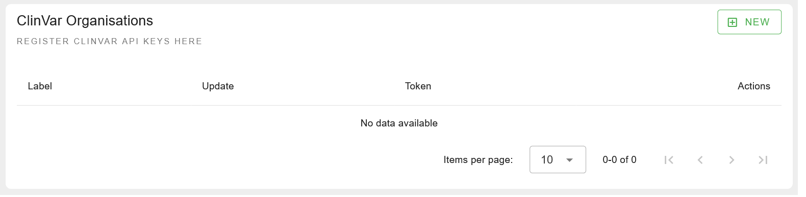
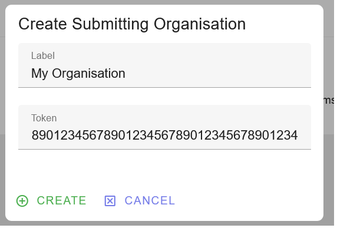
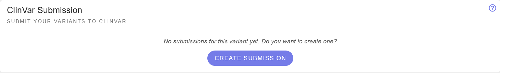
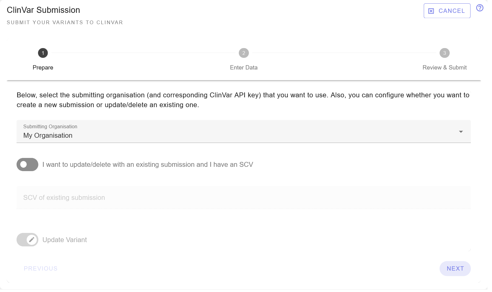
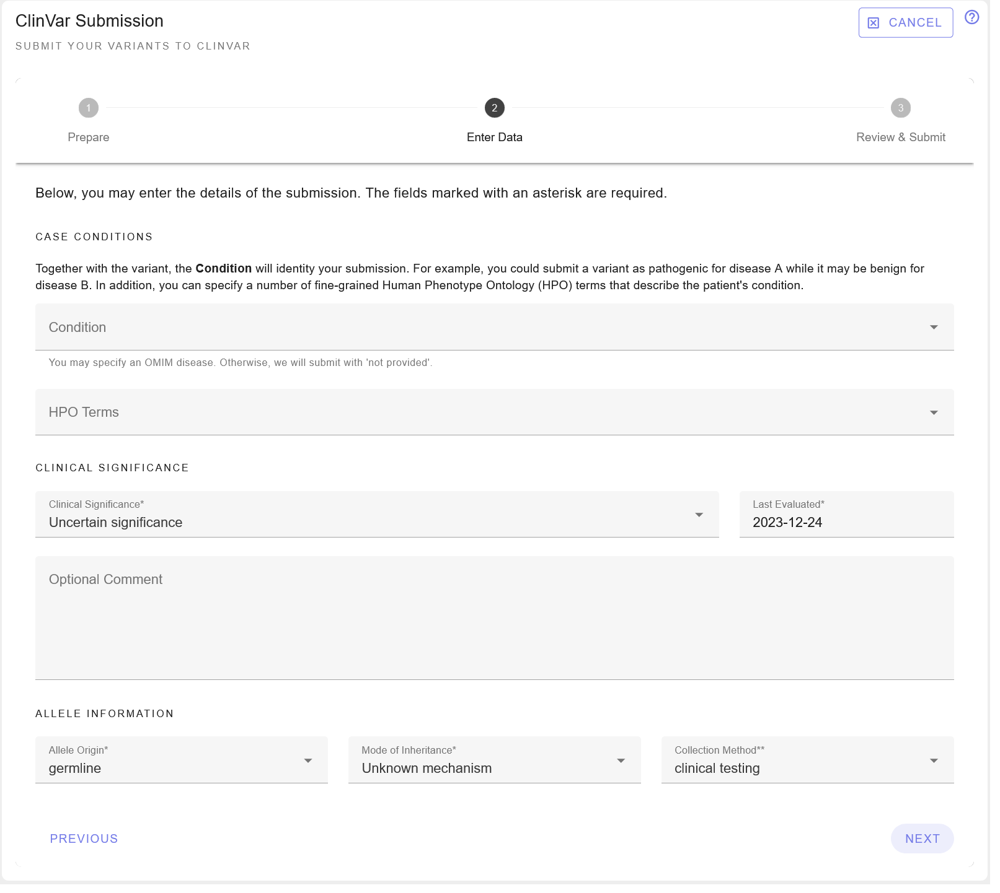
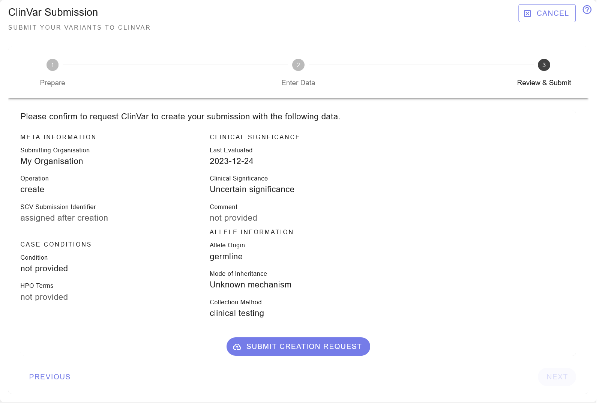
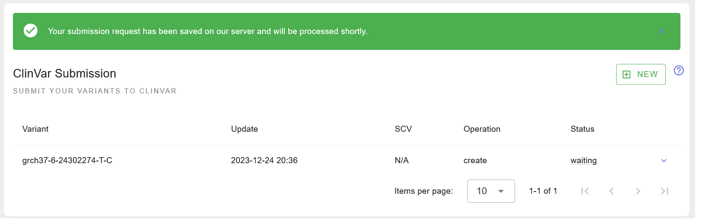
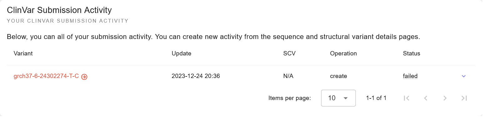

.. _doc_clinvarsub:

==================
ClinVar Submission
==================

This section describes the ClinVar submission feature of REEV.

.. _doc_clinvarsub_prerequisites:

-------------
Prerequisites
-------------

To use this feature, you will need to fulfill the following prerequisites.

1. You must have a ClinVar API key.
   For this, you will first need to register your group with ClinVar and then request API access via an email to clinvar@ncbi.nlm.nih.gov.
   You can find out more information `here about registering your organization with ClinVar <https://www.ncbi.nlm.nih.gov/clinvar/docs/submission_portal/>`__ and `here about API keys <https://www.ncbi.nlm.nih.gov/clinvar/docs/api_http/>`__.

2. You need a REEV account.
   This is easy, just click on "Login" on the top right of the REEV website.
   The account will be enabled after logging in with one of the following options.

   As a member of a research organisation in the European Union, you can login via your home organisation using LifeScience Research Infrastructure (LSRI).
   Otherwise, or if you prepare, you can login with OrcID.
   OrcID is a free service that allows you to create a unique identifier for your publications, and you can also create an OrcID account by connecting your Google/Microsoft/... account.

   We chose these two options because we do not want to handle and store passwords and both LSRI/OrcID are secure login options and available to us without charge.

Please note that the REEV authors are not affiliated with ClinVar, NCBI, or NIH.

.. _doc_clinvarsub_overview:

--------
Overview
--------

Now that you have an account with REEV, access to a group account at ClinVar and your ClinVar API key (64 character long token), we can get started.
The overall process will be as follows:

As a one-time setup, you will store the ClinVar API key in your REEV account.
Note that multiple people from the same group can do this and everything will still work.

The process is then as follows:

1. You enter the sequence or structural variant that you want to upload in to REEV and go to the page.

2. You go to the "ClinVar Submission" tab and create a new submission.

3. You send a create, update, or delete request to ClinVar by:

   a. Enter the required information (e.g., SCV accession for a deletion, or variant information for creation).

   b. Store this request on the REEV server which will put it into the work queue of REEV.
      REEV will shortly submit this request to ClinVar.

   c. ClinVar will put your request into their work queue and process it eventually.
      Note that this takes some time (in our experience 2 hours are not rare).
      During this process, ClinVar will perform validation steps and may reject your request.

      The earlier that you get feedback from ClinVar, the higher the chance that there is a problem, so be patient.
      Also see the section  :ref:`doc_clinvarsub_commonerrors`.
      After all automated validation steps are complete, you will get an SCV identifier and your submission will be published at the next release (usually the next Sunday).
      No human validation is done on the side of ClinVar.

      Compared to the Excel submission, this process is a huge improvement even if it sounds complicated.

.. _doc_clinvarsub_keysprofile:

---------------------------
ClinVar API Keys in Profile
---------------------------

After logging in, click "Profile" on the top right of the REEV website.
Then, select "Orgs / Keys" menu on the left below "ClinVar Submissions".
You will be shown the following screen.
Here, you can find all of your organisations for which you have stored an API key in REEV.
Most users, will not have more than one entry here.

To create a new entry, click on the green "New" button on the top right.
A modal will be shown where you can register a new organisation.
You have to provide a label (only used for display purposes) and the ClinVar API key.
Click "Create" to store the new entry.

You now have successfully registered your ClinVar API key and can start create submissions.

.. _doc_clinvarsub_variant_novel:

-------------------
Submit Novel Record
-------------------

Submitting a *novel* record means that a given variant has not been submitted to ClinVar before.
In this case, simply navigate to the given sequence or structural variant in REEV.
Click "ClinVar Submission" in the navigation or scroll down to the corresponding box.

Here, click the "Create Submission" button.
A step by step wizard will guide you through the process.
First, select the organisation for which you want to submit the record.
The screenshots below show the prcoess for sequence variants but the process is the same for structural variants.
Here, we focus on new submissions, in :ref:`doc_clinvarsub_variant_update` we will discuss updates and in :ref:`doc_clinvarsub_variant_delete` we will discuss deletions.
Click "Next".

On the next screen, you can enter the information that you want to submit.
The most important fields are the clinical significance and the condition.
Also, you might want to assign some HPO phenotype terms of your patient.
When you are done, click "Next".

In this screen, you can review your submission.
In the case that you want to adjust something, click "previous" to go back.
Otherwise, click "submit creation request" to start the submission.
By this, you create a submission job in REEV and a request will be sent to ClinVar.

This job will be shown in the following overview table.
It can take some time for ClinVar to process your request, and updates will be shown in the table below.

You can also go to your profile and the click "Submission Activity" on the left.
You can see all of your past and current submission activity.

.. _doc_clinvarsub_variant_update:

--------------
Variant Update
--------------

Variant updates work the same as variant creations.
However, in the first step you have to enable "I want to update/delete an existing submission and I have an SCV", enter the SCV accession, and keep the third switch as "Update Variant".
Note that you will currently have to re-fill the data in the "Enter Data" step.

.. _doc_clinvarsub_variant_delete:

----------------
Variant Deletion
----------------

Deleting a submission is even simpler.
In the first step, check "I want to update/delete an existing submission and I have an SCV", enter the SCV accession, and change the third switch to "Delete Variant".
You can optionally provide a free-text reason for removing the variant submission.

.. _doc_clinvarsub_commonerrors:

-------------
Common Errors
-------------

.. _doc_clinvarsub_commonerrors_invalidapikey:

Invalid API Key
===============

Message
    No valid API key provided.

Explanation
    The API key that you provided is not valid.
    Please check that you have entered the correct key.

Resolution
    Correct the value that you provided in the REEV profile.

.. _doc_clinvarsub_commonerrors_recordisnotnovel:

Record is not Novel
===================

Message
    This record is submitted as novel but it should be submitted as an update, including the SCV accession, because your organization previously submitted <SCV> for the same variant and condition.

Explanation
    Your organisation has already submitted a record with this “name” and condition (OMIM code or "not provided").
    ClinVar generates a variant name from your genomic coordinates.
    Each organisation can only have one submission for the combination of the condition and variant.

Resolution
    You can either submit a revision of your interpretation, (or, e.g., extend the “observed in” information), or leave the record as it is.

.. _doc_clinvarsub_commonerrors_namescannotbechanged:

Submission Names Cannot be Changed
==================================

Message
    This update changes the description of the variant for <SCV>, which is generally not allowed on a ClinVar record.
    Please check the description of the variant and correct if necessary.
    If you intend to change the description of the variant, please submit as a new record and delete this record.
    Contact clinvar@ncbi.nlm.nih.gov if you have questions.

Explanation
    Most likely, you try to update the coordinates of a variant with an existing SCV.
    ClinVar does not allow this.
    Rather, you should remove the old variant and create a new submission.

Resolution
    Remove the old variant and add a new variant instead.

.. _doc_clinvarsub_commonerrors_multipleconditions:

Multiple Conditions have been submitted without explanation
===========================================================

Message
    You provided multiple diseases as the condition for the classification.
    If they represent related diseases along a spectrum, provide uncertain for multipleConditionExplanation.
    If they represent diseases that occur together in an individual with the variant (this case is rare), provide co-occurring for multipleConditionExplanation.”

Explanation
    Multiple Condition IDs have been submitted for single variant. Check if this has been intentional.
    If multiple conditions are to be submitted, a reason needs to be included with the submission.

Resolution
    Explicitly add either Uncertain, Co-occurring or Novel disease to the list of CONDITIONS.
