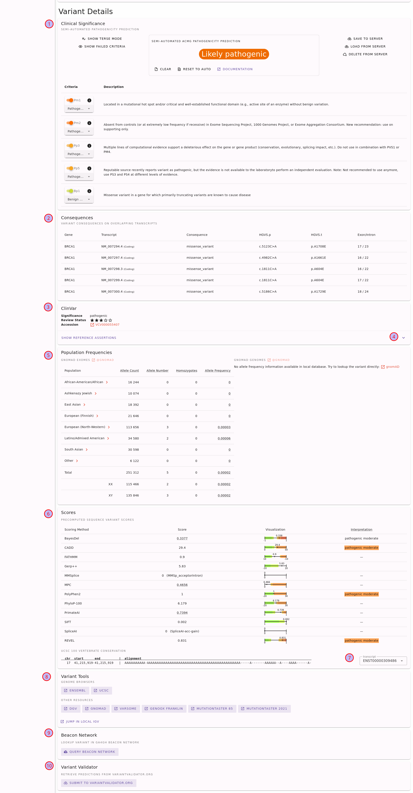

.. _doc_quickstart:

==========
Quickstart
==========

Do you like to jump heads-first into the water?
Then this is the place for you!
For a more in-depth explanation of REEV, see the :ref:`tutorial <doc_tutorial>`.
However, REEV also contains helpful help links throughout the web interface so you can also look up information as you go.

.. _doc_quickstart_introduction:

------------
Introduction
------------

We have developed REEV (Review, Evaluate and Explain Variants) to help clinicians and researchers in rare disease genetics with an open and free platform to explore comprehensive information about genes as well as sequence and structural variants.
REEV is designed to help you to quickly yet comprehensively record all the important information on a variant and, on the basis of this, to evaluate it on the basis of the ACMG criteria\ :footcite:p:`Richards:2015`.
To this end, REEV also integrates methods that allow users to (semi-)automatically fill the individual ACMG criteria sections to facilitate interpretation.

Here, we provide a quick start as well as a full tutorial guiding you through the process on reviewing and evaluating genes and variants with the help of REEV.

.. _doc_quickstart_home:

---------
Home Page
---------

First, go to the REEV home page at https://reev.bihealth.org and you will be the following screen.

    The REEV home page.

The most important part is the search bar (1).
Here, you can enter your query, which can be a gene symbol or the description of a sequence or structural variant.
The example box (2) has a couple of examples to get you started and so you can learn some examples.
You can look at the section :ref:`doc_queries` to learn about the supported queries.

.. admonition:: Sequence vs. Structural Variants

    We distinguish between *sequence* and *structural* variants.
    Sequence variants are those where the actual sequence is of importance.
    This is contrast to structural variants that are generally bigger and where the change of structure in the genome is more important.
    One could also make a distinction between small variants (say up to 50bp in size) and structural variants.
    Then, single nucleotide variants (SNVs) and small insertions/deletions (indels) would be sequence variants.

    However, in REEV the distinction is based on the query format.
    For sequence variants, variants are eventually represented by the changed chromosomal sequence.
    For structural variants, variants are represented by the genomic coordinates of the change.
    Read on, you will see what you mean in the examples.

.. _doc_quickstart_gene:

----------------
Looking at Genes
----------------

Let us get started by looking at a gene.
Enter ``FBN1`` into the search bar and press enter or click the search button.
You will be redirected to the gene details page for *FBN1*.

    The gene details page for *FBN1*.

Here, you can find the following information.

1. The basic gene information, including a short summary from NCBI Entrez.
2. Fold-out button for more details (here shown already expanded).
3. The gene fold-out pane displays information such as alternate identifiers, links to locus-specific databases, and NCBI references into functions.
4. Information about potential pathogenicity of the gene through haploinsufficiency or triplosensitivity.
5. Information about associated conditions in terms of phenotypes (HPO terms) and diseases (OMIM or Orphanet).
6. Fold-out button for more details on the associated conditions.
7. Gene expression information from the GTEx project.
8. Aggregated variant count from ClinVar regarding variant type and clinical significance assessments.
9. A plot that displays the population frequency of variants assessed as benign/uncertain/pathogenic in ClinVar.
10. A plot of the ClinVar variant assessments throughout the gene.

Note that you can use the little (?) links to get more information about the displayed information.
These links will bring you to this documentation in a new browser tab/window.

Also note that you can copy and paste the URL to the gene details page and send it to your colleagues or create a bookmark of it.

.. _doc_quickstart_seqvar:

----------------------------
Looking at Sequence Variants
----------------------------

Next, let us look at a SNV, which is referred to a *sequence variant* in REEV.
If you want to go back to the home page, you can also reach there by clicking the little coral logo on the top left of the page.
However, you can also enter the variant in the search bar at the top of the page.

You can enter variants in a number of formats, including HGVS format.
See the section :ref:`doc_queries` for a list of supported formats.
We will now look at the variant ``NM_000052.5(ATP7A):c.1172G>C``.
Copy this variant into the search bar and press enter.
You will be redirected to the variant details page for this variant.

.. _doc_quickstart_quickstart_sharing_urls:

Sharing URLs
============

First of all, note that you are redirected to the following URL.

- https://reev.bihealth.org/seqvar/grch37-X-77245290-G-C?orig=NM_000052.5(ATP7A):c.1172G%3EC

This URL is stable and you can send it to your colleagues to share a variant.
You can find out more about the URLs in the section :ref:`doc_urls`.

.. _doc_quickstart_quickstart_variant_details:

Variant Details
===============

On the top of the variant details page you will see the information about the gene which is identical to what is described in the section :ref:`doc_quickstart_gene`.
We will thus focus on the second half of the page shown in the following figure.

    Sequence variant details page for the variant ``NM_000052.5(ATP7A):c.1172G>C``.

You can find the following elements on the page:

1. Semi-automated ACMG variant class assessment based on the InterVar\ :footcite:p:`Li:2017` tool.
2. A table with the impact of the variant on different transcripts.
3. Information with ClinVar assertions on the variant.
   This displays the ClinVar reference assertion with the most pathogenic significance and its review status.
4. To obtain more information, fold out the card and look at the individual reference assertion.
   Each ClinVar reference assertion aggregates the submissions of a variant for a specific condition.
5. The population frequencies in dfiferent populations.
   Click on the population name to obtain frequency details by XX/XY karyotype.
6. Variant pathogenicity scores from different tools, aggregated by dbNSFP.
   To help interpreting the variant scores, we show scores calibrated following :footcite:t:`pejaver:2022` where applicable (currently for all scores except for SpliceAI).
7. Also, you can find the UCSC 100 vertebrate conservation here on the protein level.
8. Link-outs to genome browsers and various external tools to help you to assess the variant further.
9. Query the GA4GH Beacon network for presence of the variant at other sites.
10. Submit the variant to VariantValidator to obtain gold standard HGVS representation.
    This is useful for a "second opinion" on the variant representation before using the variant description in a journal submission or report.

For more details, see the section :ref:`doc_tutorial_seqvar` of the :ref:`doc_tutorial` or use the little (?) help icons on the page.

.. _doc_quickstart_strucvar:

------------------------------
Looking at Structural Variants
------------------------------

As the last step of the quickstart, let us look at a ~100kb deletion on chromosome 17 from base pairs 41,176,312 to 41,277,500 (GRCh37 coordinates).
In ISCN array notation, this is ``GRCh37 17q21(41176312_41277500)x1``.
For example, you can enter the variant using the ISCN notation from above or in a color-formated as ``DEL:17:41176312:41277500``.
You can find full list of query formats in section :ref:`doc_queries`.
Currently, REEV only supports copy number variants: deletions and duplications.

You will be redirected to the following URL.
Also note that the URL to the structural variant details page is stable and can be shared with colleagues.

- https://reev.bihealth.org/strucvar/DEL-grch37-17-41176312-41277500?orig=GRCh37+17q21+(41176312_41277500)x1

At the top of the page, you will see information also shown int he following figure.

    Top of structural variant details page for the variant ``DEL:17:41176312:41277500``.

1. You will see the list of genes that are overlapping with or close to the structural variant.
   Next to the symbol, you see the how the variant is affected.
   For example, *BRCA1* and *RND2* are fully contained while the variant is upstream of both *NBR2* and *VAT1*.
   You can click on the gene symbol to display the gene details on this page.
   You can also use the little right-pointing arrow in the circle to go to the gene details page.
2. When there are many genes then you can browse through them with the page control.
3. In the case of many overlapping genes, you probably want to use a different sort order than by gene symbol.
   You can use the "sort by" control to pick out the scores to sort by, e.g., gnomAD pLI score or the ClinGen haploinsufficiency or triplosensitivity assessment.

The details for the currently selected genes will be displayed below the gene table.
All of this has been explained in the section :ref:`doc_quickstart_gene` already so we will not repeat this here.

The second half of the page focuses on the variant rather than the overlapping genes.
This is shown in the following figure.

    Second half of structural variant details page for the variant ``DEL:17:41176312:41277500``.
    Note that a large part of the ACMG assessment card has been cut out, indicated by the gray area.

4. Details on overlapping variants in ClinVar.
   You can also unfold each row to display the individual reference ClinVar assertions.
5. The variants will be sorted by reciprocal overlap (the fraction of the overlap of the variant - yours and the ClinVar one - and the large of the variant lenghts).
   This is useful to find the "best fitting" one.
6. Open the location of the variant in an external genome browser or an external tool for further analysis.
7. Semi-automated assessment of the variant following ACMG standards\ :footcite:p:`Richards:2015` using the AutoCNV\ :footcite:p:`Fan:2021` tool.
8. See the location of the variant in an internal genome browser with useful tracks for interpreting the variant.

For more details, see the section :ref:`doc_tutorial_strucvar` of the :ref:`doc_tutorial` or use the little (?) help icons on the page.

.. footbibliography::
