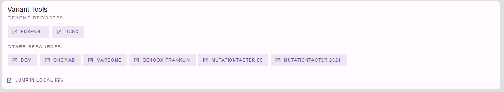
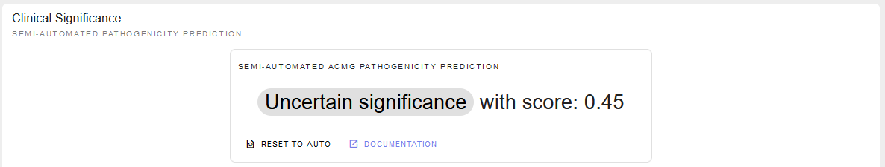
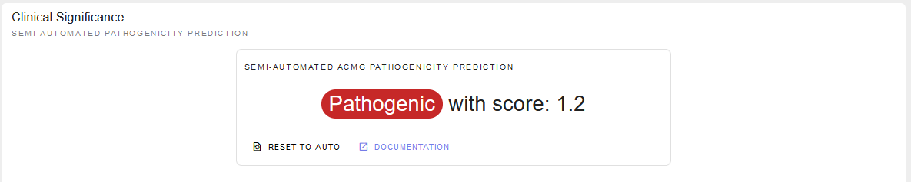

.. _doc_tutorial:

========
Tutorial
========

.. _doc_tutorial_seqvar:

-----------------
Sequence Variants
-----------------

We came across the following interesting missense variant in *GLI3* in a patient with synpolydactyly which we want to explore in more detail.

.. list-table::
   :header-rows: 1

   * - Genomic variant [hg19/GRCh37]
     - Gene
     - RefSeq transcript
     - Variant effect
   * - chr7:42012159:T:G
     - GLI3
     - NM_000168.6
     - c.1880A>C, p.(His627Pro)

Lets go the `REEV start page <https://reev.cubi.bihealth.org/>`__ and enter our variant here:

   The REEV home page.

To do so we have two options of entering this variant:

a) Genomic Variant
------------------

We could go for the genomic variant and enter here:

.. code-block:: none

    chr7:42012159:T:G

.. note::

   Pay attention to choosing the correct reference genome in the selection box to the right.

b) Variant on cDNA Level
------------------------

Go for the variant on cDNA level providing the respective RefSeq transcript variant and gene:

.. code-block:: none

    NM_000168.6(GLI3):c.1880A>C

which then brings us to REEV's gene and variant information.
We will go through this step-by-step but if you want to jump to a specific information you can also use the overview and links on the left: 

.. figure:: img/tutorial/seqvar-sidebar.png
   :width: 20%
   :align: center

   
Let's start with a look at the gene information provided in the first box:

This information about the *GLI3* gene already hints at a possible link to our patient's phenotype.

Useful information on gene-phenotype-associations can also be found via the linkouts below, e.g. to *MGI*.
Further useful links and information on the gene can be found when clicking on the `“more”` button in lower right corner:

For our case, we find *GLI3* an interesting gene and move on to find out more on potential gene pathogenicity from the box below:

Since we are examining the missense variant we are especially interested in the gnomAD Z-score provided here (1). 
Noting a Z-score of 0.52 we see that *GLI3* is not missense constrained meaning that *GLI3* is tolerant for missense variations whereas with a pLI of 1.00 and a LOEUF of 0.20 gnomAD data as well as the displayed ClinGen and DECIPHER data all state haploinsufficiency meaning that *GLI3* is intolerant for heterozygous loss of function variants. 
We conclude that we have to look further into the pathogenicity of our specific missense variant on the variant level, if we consider *GLI3* to be a candidate gene for our patient's phenotype. 
We already suspect that this might be the case from the information above and know find the respective evidence in the box below:

.. figure:: img/tutorial/gene-phenotype-card.png
   :width: 100%
   :align: center

Yes! We find several known OMIM phenotypes for *GLI3* fitting our patient's phenotype. 
If we have logged in and provided our patient's phenotype e.g. `HP:0001177 - Preaxial hand polydactyly;  HP:0001159 - Syndactyly` we will also find a score of how well our case's and the gene's phenotypes match each other. 
Apart from the OMIM phenotypes we also find similar links to Orphanet - and again we will find more information when clicking on “more” in the lower right corner (1).

If we had not found an established gene-phenotype-association in the section before, the following one would be of particular interest for us: 
Is our gene expressed in a tissue fitting our patient's affections? Let's look at the tissue specific gene expression from GTeX provided here:

But we want to come back to our variant at hand ``NM_000168.6(GLI3):c.1880A>C p.(His627Pro)``. 
We now know that a *GLI3* variant causing a heterozygous loss of function would cause a disease fitting our patient's phenotype. 
But is our variant a (likely) pathogenic one?

Before we finally look into the variant itself let's have a last look on the gene level: are there pathogenic missense variants in *GLI3* at all, e.g. in the ClinVar database? 
If so, in which part of the gene are they located?

In line with the low Z-score retrieved from the gnomAD database, we see that most missense variants in ClinVar are classified as benign. 
However, indeed there are also some pathogenic missense variants. 
Time to look at the variant level and find out whether our missense variant is one of these few!

The semi-automated ACMG variant class assessment based on the InterVar tool tells us: we don't know…

But let's see whether we can assess this in more detail. 

First, we have a more detailed look on the variant and its consequences in the different transcript variants and protein isoforms of a gene:

Here, we see that there is only one RefSeq transcript variant and our variant is located in exon 13 of 15 
(- an important information e.g. also for nonsense and frameshift variants and whether or not they are subjected to nonsense mediated decay). 

Is our variant a known disease variant? E.g. in the ClinVar database?

Yes, it is! Again, clicking on expand in the lower right corner and of course the link to the original ClinVar entry reveal more details:

.. figure:: img/tutorial/variant-clinvar-card-more.png
   :width: 100%
   :align: center

We see that our variant is listed once in the ClinVar database as likely pathogenic for the OMIM phenotype polydactyly, postaxial type 1 (PAPA1) fitting the *GLI3*-related spectrum also fitting our patient's phenotype. 
We thus can assign the ACMG criterion PP5 (or novel recommendation rather PS4 on supporting level) for our variant classification and adjust the ACMG rating above accordingly.

To do so, we have to select “show failed criteria” (1) in the ACMG rating section above:

and can then set PS4 to true on supporting level:

Rating the variant's pathogenicity let's move on to its frequency in the healthy control database gnomAD:

In the respective next section we see that our variant is absent from controls and can check the PM2 criterion. 
Note, that REEV reminds us that this criterion should be used at supporting level only according to the novel ACMG recommendations:

.. figure:: img/tutorial/variant-acmg-rating-pm2.png
   :width: 100%
   :align: center

Next, we want to check whether our variant is predicted to be pathogenic by bioinformatic prediction tools. 
REEV provides us not only with an overview of the relevant prediction scores used in the assessment of SNVs, but also with the hint on which level of confidence the respective prediction can be used for ACMG criterion PP3 based on the `recent ClinGen recommendations <https://doi.org/10.1016/j.ajhg.2022.10.013>`__

Since they suggest that “For missense variants, to determine evidence for codes PP3 and BP4, we recommend that, for most situations, clinical laboratories use a single tool, genome-wide, that can reach the strong level of evidence for pathogenicity and moderate for benignity (BayesDel, MutPred2, REVEL, or VEST4)” and we in our lab chose to always use REVEL, we can apply the PP3 on strong level for our variant:

Note, that REEV smartly reminds us that we should not apply the PP3 criterion when PVS1 or PM4 have already been used (not the case for our missense variant here).

Also note, that beyond the PhyloP-100 score REEV also gives a nice view on conservation especially helpful for evaluating missense variants:

If we are looking at a gene with different transcript variants we can choose the one of interest in the selection box on the right.

Still missing some information? Here is more useful links REEV provides us at the end:

By clicking the “Jump in local IGV” button we can also look at our variant when we have the respective bam-file opened in our local IGV. 

Last but not least, we can connect with others on our gene, variant and phenotype of interest via the beacon network (when logged in) 

and run our variant through variant validator for a last check:

On going through this information we adjusted and added to some of the semi-automated ACMG criteria. 
Let's scroll back up to the ACMG rating tool and check the criteria ultimately applied and the final conclusion we came to with the help of all the information provided in REEV:

PM1, PM2, PP3 and BP1 had already been automatically selected by the InterVar tool. 
However, we were able to adjust PM2 to supporting and PP3 to strong level now with the help of REEV. 
Additionally, we applied the PS4 criterion on supporting level as we noticed that this variant is already listed in ClinVar as a pathogenic variant with one star. 
So solely by the help of the information provided by REEV we were able to correct the InterVar scoring as a variant of uncertain significance to a likely pathogenic variant!

But, of course, since we also have some clinical information on our patient at hand, we can additionally state the patient's phenotype fits the *GLI3*-related spectrum. 
However, there are more genes than just *GLI3* causing polydactyly, so that we apply the PP4 criterion on supporting level only.  
Finally, we found our variant to be de novo by segregation analysis using sanger sequencing without confirmation of paternity and maternity, so we can apply PM6 on moderate level. 
Using this additional information we can even conclude with a rating of our variant as pathogenic:

.. _doc_tutorial_strucvar:

-------------------
Structural Variants
-------------------

Happy about the solved SNV case we are curious to see what REEV can provide and help us with when it comes to the trickier structural variants!

In such another case we came across the following deletion in a patient with oligodontia which we now want to explore in more detail.

.. list-table::
   :header-rows: 1

   * - Genomic variant [hg19/GRCh37]
   * - DEL:chr14:37131998:37133815

As you can see you can enter your SV of interest by providing the affected chromosomal position preceded by the indication of the type of SV (DEL or DUP). 

.. note::

   Note, that you can also provide your variant according to ISCN. 
   For example, this might be helpful, when you are interested in a variant that was reported in an arrayCGH test.

Let's see what REEV tells us on this structural variant. 
The overview shows us that this deletion affects the PAX9 gene and that this gene shows haploinsufficiency according to ClinGen, Decipher and RCNV scores as well as the gnomAD LOEUF score:

So, just one affected gene - but a potential candidate!

Note, that if we had a larger SV affecting multiple genes, REEV could help us prioritize that larger set of genes by sorting by different criteria using the sort by selection box on the right (1):

For deletions we could sort the gene list by the different haploinsufficiency scores to only look at genes that likely do not tolerate a heterozygous deletion. 
Vice versa, for duplications it would be helpful to sort the gene list by triplosensitivity scores.

For our deletion we now know that the gene it affects is intolerant for heterozygous loss of function variants, so it could be potentially pathogenic. 
But is it a known disease gene? If so, does the disease fit our proband's phenotype? 
To answer this question, let's have a look on the gene overview and gene-phenotype-associations provided by REEV:

Those of you who started with the sequence variant tutorial already know this view - those of you who did not may find the detailed explanation in this respective section above.
In brief, we find a promising gene-phenotype-association of PAX9 (1-3) with our patient's phenotype.

And again see above for the helpful display of gene expression data if PAX9 wasn't a known disease gene but might be an interesting novel candidate gene…

… as well as the display of ClinVar data you also know by now from the section above:

.. figure:: img/tutorial/strucvar-gene-clinvar.png
   :width: 100%
   :align: center

In line with the haploinsufficiency scores and low LOEUF score this display of ClinVar data tells us that with 29 out of 30 the vast majority of loss of function variants in PAX9 are considered pathogenic, strengthening our guess we might be onto something with our deletion here.

So, to nail that down let's have a look into the variant details:

Mhm, this is not a known ClinVar variant yet (1). 
But the links to ENSEMBL and UCSC (2) tell us that this variant affects exon 3 of the MANE transcript variant NM_006194.4 of the PAX9 gene which encodes for the majority of PAX9, rendering this variant a loss of function variant. 

We also see that this deletion is absent from healthy controls in gnomAD (3). 

I think we can all agree: a very hot variant! 
But can we rate it pathogenic according to the `ACMG and ClinGen recommendations for copy-number variants <https://doi.org/10.1038/s41436-019-0686-8>`__?

Semi-automated prediction from `autoCNV <https://doi.org/10.1186/s12864-021-08011-4>`__ implemented in REEV tells us it still remains unclear. 
We have to use our knowledge gathered from the REEV information above and our clinical knowledge on this case, let's go through the CNV criteria!

We find that criteria L1 and L2 are checked correctly for L1A and L2E true. 
Note, that we have to use L2E because both breakpoints of our deletion are within the same gene and that L2E is assigned with 0.45 points which is also the correct value: 
Since the deletion abrogates more than 50% of the protein coding sequence we can consider it a loss of function variant and assign the ACMG criterion PVS1 on strong level, equaling a score of 0.45. 

L3 is an easy one and also pre-checked correctly to L3A:

Let's continue on to the manual case specific part:

REEV showed us 29 (likely) pathogenic loss of function SNVs in the ClinVar database (see screenshot above). 
As we have no information on inheritance from this ClinVar data and there are no matching SVs reported yet, we can only give the max. 0.3 points at L4E here:

But we do have inheritance information on our case, of course! 
Here, the PAX9 deletion occurred de novo in a patient with oligodontia and their parents are known to be healthy. 
So, we can assign L5A with a score of 0.45:

Let's scroll back up and see where we have landed on rating this variant with the help of REEV!

Another solved case it is for us and REEV!
